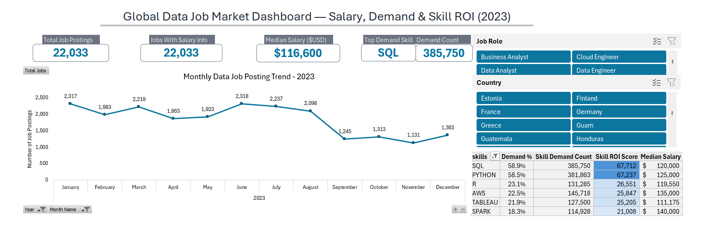

# Global Data Job Market Dashboard — Salary, Demand & Skill ROI (Excel)

## Overview  
This project is an interactive Excel-based business intelligence dashboard designed to analyze the global data job market. It helps users explore job demand trends, salary benchmarks, and high-value skills using dynamic filters and real job posting data.

The dashboard allows users to slice data by role, country, and time period to instantly generate insights for career planning and market research.

---

## Project Objective  
The main goals of this project are to:

- Analyze global data job posting trends  
- Identify the most in-demand technical skills  
- Compare salary distribution across skills and roles  
- Calculate skill return on investment (ROI)  
- Provide an interactive career market exploration tool  

---

## Key Features  

- Interactive slicers for:
  - Job Role  
  - Country  

- Automated KPI metrics:
  - Total Job Postings  
  - Jobs With Salary Information  
  - Market Median Salary  
  - Most In-Demand Skill  

- Monthly job posting trend analysis  
- Skill demand and salary comparison table  
- ROI-based skill ranking system  
- Dynamic pivot-based calculations  
- Clean dashboard layout optimized for decision-making  

---

## Tools & Skills Used  

- Microsoft Excel  
- Power Query (Data Import & Transformation)  
- Power Pivot (Data Modeling)  
- DAX (Measures & Calculated Columns)  
- Pivot Tables  
- Advanced Excel Charts  
- Interactive Slicers  
- Dashboard Design & Layout Optimization  

---

## Dashboard Preview  

### Main Dashboard View  
 

### Skill Analysis Section  
 

---

## How to Use  

1. Open the Excel dashboard file  
2. Use slicers to select:
   - Job Role  
   - Country  
3. View automatically updated KPIs  
4. Analyze monthly job trend chart  
5. Review skill demand, salary, and ROI metrics  
6. Use insights to evaluate high-value career skills  

---

## Key Insights  

- SQL remains the most in-demand skill across data roles  
- Skill demand does not always correlate directly with salary  
- Certain technical skills provide higher ROI despite lower popularity  
- Hiring trends fluctuate seasonally across the year  
- Market salary benchmarks vary significantly by region and role  

---

## Notes  

- The dashboard uses a star schema data model for optimized performance  
- All calculations are powered by DAX measures inside Power Pivot  
- Pivot connections are dynamically linked across all visuals  
- Slicers are connected to all dashboard components for consistent filtering  

---
